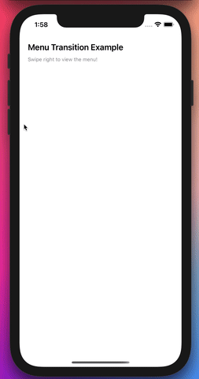

# iOS-InteractiveMenuTransition-Example
An example of a image expand transition between view controllers implementing the UIViewControllerTransitioningDelegate and UIPercentDrivenInteractiveTransition.

## Demo
  

Here's a demo of the project. Feel free to check the code to learn how to implement this!

## Usage
If for whatever reason you want to use this transition in your project, make sure you add the following files:
- `CustomTransition.swift`
- `PresentationAnimator.swift`
- `DismissAnimator.swift`

Then, in the "base" view controller that will "present" your "menu" view controller, all you need to do is add the following code. You don't ever need to call "self.present" by yourself, it's handled by the pan gesture automatically.  

```swift
// Inside your view controller

private var transition = CustomTransition(menuWidth: 0.75)

// ...

// Make sure to call this somewhere one time only
func setupTransition() {            
    let vc = MenuViewController()            
    vc.modalPresentationStyle = .custom
    vc.transitioningDelegate = self.transition
    self.transition.setupPan(startVC: self, finishVC: vc)
}
```